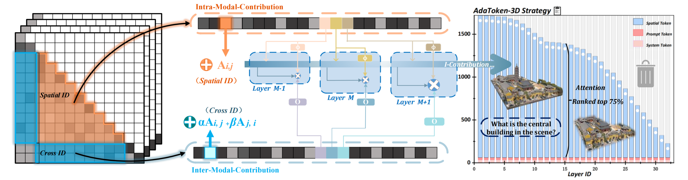

# AdaToken-3D: Dynamic Spatial Gating for Effcient 3D Large Multimodal-Models Reasoning
An adaptive spatial token optimization framework that dynamically prunes redundant tokens through spatial contribution analysis

      

